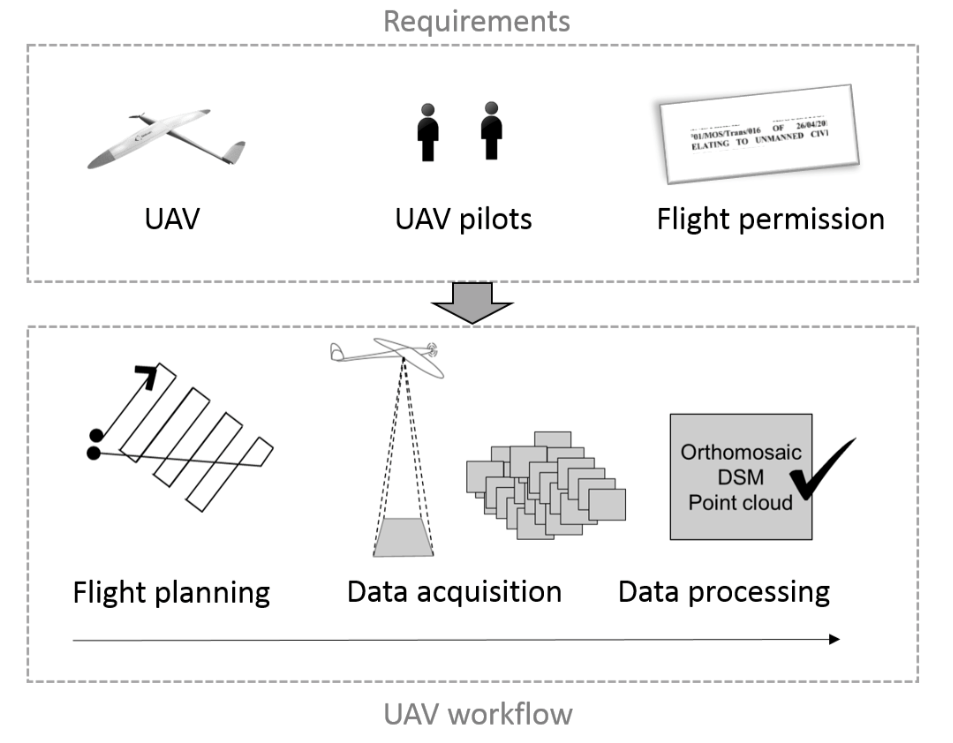
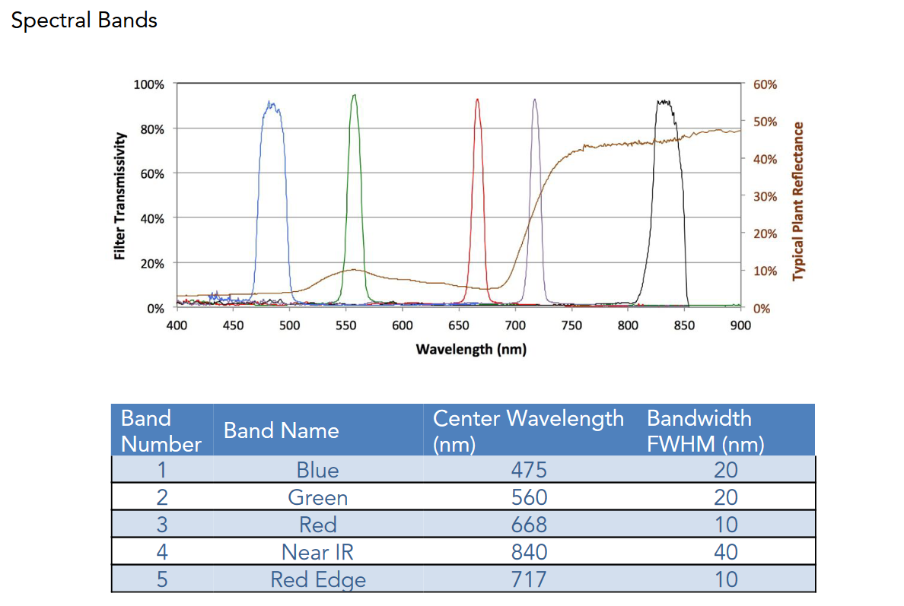
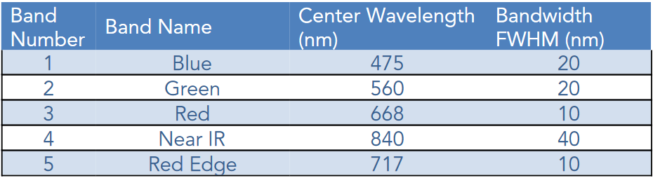
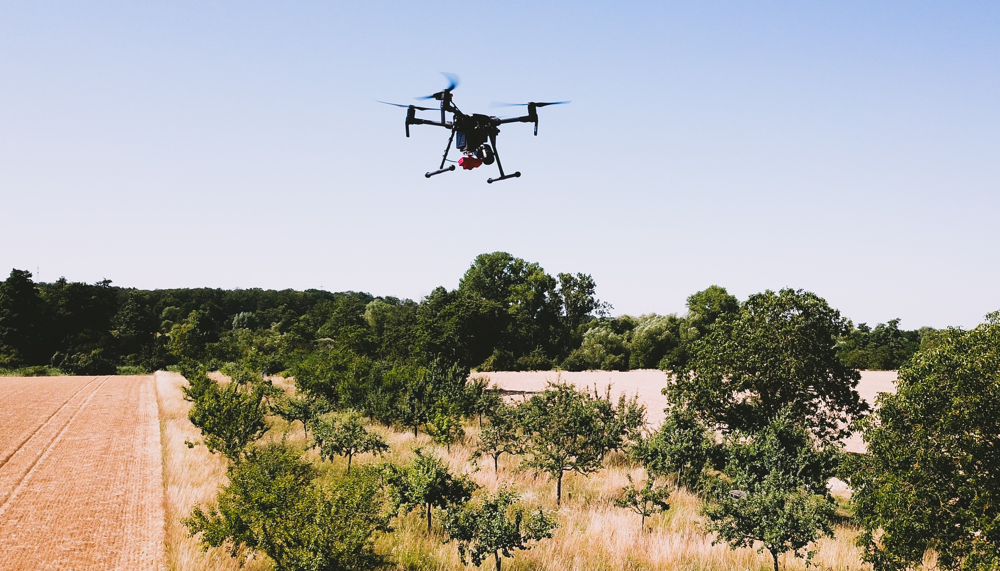

# An introduction to acquire and process data with an Unmanned Aerial Vehicle (UAV)
A documentation to acquire data via UAV and process data with Structure-from-Motion (SfM). 

---

##### Some basics about remote sensing can be found [here](https://web.pdx.edu/~nauna/resources/15-sensors.pdf).

---

## Aim of the workshop
* Get to know what kind of equipment for different UAV systems is needed
* Get to know how to plan and perform an UAV fligth
* Get to know how to use a GNSS receiver to acquire Ground Control Points (GCPs)
* Acquire own data with an UAV.

## Exercises
1. Proof if the equipment ist comprehensive
2. Prepare the UAV for takeoff
3. Plan the fligth route 
4. Perform the UAV fligth
5. Landing UAV and take care of the data
6. Acquire GCPs with the GNSS
7. Clean up

---

     Principle of an UAV mapping mission

<!--  -->

     

     <a href = "https://its4land.com/fly-and-create/"> Source: its4land.com </a>

---

# I. Fligth planning

<!--
## Our UAV platforms, related sensors, weigth and fligth max. time
1. [DJI Matrice 200 Series](https://www.dji.com/matrice-200-series)
     * [DJI Zenmuse X5S camera](https://www.dji.com/zenmuse-x5s) (RGB)
     * [Micasense RedEdge-M (Legacy) camera](https://support.micasense.com/hc/en-us/articles/360001485134-Getting-Started-With-RedEdge-M-Legacy-) ([R, G, B, NIR, RedEdge](https://raw.githubusercontent.com/GeowazM/Introduction_UAV/main/images/RedEdge-M_bands_User_Manual_spectral_bands.png?token=GHSAT0AAAAAAB6YWBWETQT3GCPAG63BJLESY7V6L2Q)) -->

     
<!--  -->
<!--  -->
 
<!--
2. [DJI Phantom 3 Professional](https://www.dji.com/phantom-3-pro?site=brandsite&from=insite_search)
    * 1/2.3” CMOS (RGB)

3. [DJI Mini 2](https://store.dji.com/product/mini-2?gclid=CjwKCAiAl9efBhAkEiwA4ToriiKMlmGKfPlxCbG1N3XQUkcqFHg9xXjMrqLKxbfWwHxQ7Q1gixHzJBoCFAYQAvD_BwE&vid=99411&set_region=US&from=store-nav)
    * 1/2.3” CMOS (RGB) -->

## Overview of available UAVs or this workshop

| Platform | Sensor | Spectral coverage | Max. fligth time | Weigth | [Drone license](https://www.dfs.de/homepage/en/drone-flight/checklist-for-drone-pilots/) | 
| ----------- | ----------- |  ----------- | ----------- | ----------- | ----------- |
| [DJI Matrice 200 Series](https://www.dji.com/matrice-200-series) | [DJI Zenmuse X5S camera](https://www.dji.com/zenmuse-x5s) | RGB | ~24 min | 4 kg | A2 |
| [DJI Matrice 200 Series](https://www.dji.com/matrice-200-series) | [Micasense RedEdge-M (Legacy) camera](https://support.micasense.com/hc/en-us/articles/360001485134-Getting-Started-With-RedEdge-M-Legacy-) | [R, G, B, NIR, RedEdge](https://raw.githubusercontent.com/GeowazM/Introduction_UAV/main/images/RedEdge-M_bands_User_Manual_spectral_bands.png?token=GHSAT0AAAAAAB6YWBWETQT3GCPAG63BJLESY7V6L2Q) | ~24 min | 4 kg | A2 |
| [DJI Phantom 3 Pro](https://www.dji.com/phantom-3-pro?site=brandsite&from=insite_search) | 4K: 1/2.3” CMOS | RGB | ~23 min | 1.3 kg | A1-A3 (none urban area) |
| [DJI Mini 2](https://store.dji.com/product/mini-2?gclid=CjwKCAiAl9efBhAkEiwA4ToriiKMlmGKfPlxCbG1N3XQUkcqFHg9xXjMrqLKxbfWwHxQ7Q1gixHzJBoCFAYQAvD_BwE&vid=99411&set_region=US&from=store-nav) | 4K: 1/2.3” CMOS | RGB | ~31 min | 0.249 kg | None |

### Additional Gadgets
- Gimble GNSS receiver
- EMLID GNSS system
- Mobile RTK system for UAVs (P3 Pro)

--- 

# II. Data acquisition

---

# III. Processing

- License for Agisoft Metashape Professional

---

#### Just a nice image

More information [here](https://rgeo.de/en/p/streuobst/)

 

---

