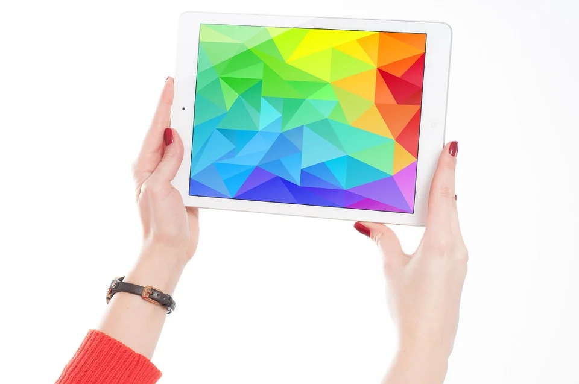

# An introduction to acquire and process data with an UAV
A documentation to acquire and process data with an UAV and Agisoft Metashape Professional

 

     

More information: https://rgeo.de/en/p/streuobst/

### Requirements:
- Unmanned Aerial Vehicle (UAV)
     Sensors used in this case
     - Zamnese X5S camera
     - Micasense Multispectral camera (4 bands including NIR)
- License for Agisoft Metashape Professional

## I. Data acquisition
The data acquisition includes the UAV fligth itself and the measureing of the ground control points (GCP).

#### 1. UAV fligth

     
- Requirements:
     - iPad with DJI app
     - SD card
- For the multispectral camera:
     - Reference panel
     - Micro SD card
     
Set the fligth route via app and set the fligth parameters. The fligth parameters depend on the target area and objects.

Here are some fligth parameters based on the experiences with monitoring orchards.
Fligth heigth: 30m or with high trees 35m
Image overlaps: 90% in fligth direction and 70% orthogonal to the fligth direction.

After landing, a check of the ligth on top of the multispectral camera is needed to eliminate potential failures.

     
     

#### 2. Measureing Groud Control Points (GCP)
- Requirements:
     - [TrimbleGeo7xGNSS](https://geospatial.trimble.com/products-and-solutions/geo-7x-gnss)

The GCP are important to georeference the processed data precisly. 
More information can be found [here](https://www.dronedeploy.com/blog/what-are-ground-control-points-gcps/).

The GCP can be exported and printed automatically with Agisoft Metashape.
Theoretically, with sufficient resolution of the GCP Agisoft Metashape should recognize the GCP in the data processing automatically. However, if this is not the case the GCP have to set manually.

THe GCP measurements need to be exported as a csv file for every measurement and can be copied on a SD card in the 

## II. Data processing

