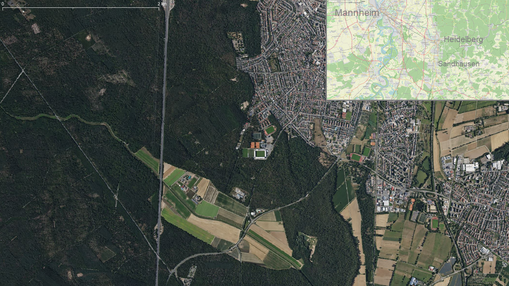

# An introduction to acquire and process data with an Unmanned Aerial Vehicle (UAV)

     Source: <a href = "https://rgeo.de/en/p/streuobst/"> rgeo </a>

---

This repository serves as a short guide to
* acquire data with an UAV and 
* process data via Structure-from-Motion (SfM) 

##### Some principles about remote sensing can be found [here](https://web.pdx.edu/~nauna/resources/15-sensors.pdf).

---

## Aim of the workshop
* Get to know what kind of equipment for different UAV systems is needed
* Get to know how to plan and perform an UAV fligth
* Get to know how to use a GNSS receiver to acquire Ground Control Points (GCPs)
* Acquire own data with an UAV.

---

     Principle of an UAV mapping mission

<!--  -->

     

     Source: <a href = "https://its4land.com/fly-and-create/"> its4land.com </a>

---

 

## Overview: *Available UAV models and some key fact* 

| Platform | Sensor | Spectral coverage | Max. fligth time per battery | Weigth | [Drone license](https://www.dfs.de/homepage/en/drone-flight/checklist-for-drone-pilots/) | 
| ----------- | ----------- |  ----------- | ----------- | ----------- | ----------- |
| [DJI Matrice 200 Series](https://www.dji.com/matrice-200-series) | [DJI Zenmuse X5S camera](https://www.dji.com/zenmuse-x5s) | RGB | ~24 min | 4 kg | A2 |
| [DJI Matrice 200 Series](https://www.dji.com/matrice-200-series) | [Micasense RedEdge-M (Legacy) camera](https://support.micasense.com/hc/en-us/articles/360001485134-Getting-Started-With-RedEdge-M-Legacy-) | [R, G, B, NIR, RedEdge](https://raw.githubusercontent.com/GeowazM/Introduction_UAV/main/images/RedEdge-M_bands_User_Manual_spectral_bands.png?token=GHSAT0AAAAAAB6YWBWETQT3GCPAG63BJLESY7V6L2Q) | ~24 min | 4 kg | A2 |
| [DJI Phantom 3 Pro](https://www.dji.com/phantom-3-pro?site=brandsite&from=insite_search) | 4K: 1/2.3” CMOS | RGB | ~23 min | 1.3 kg | A1-A3 (none urban area) |
| [DJI Mini 2](https://store.dji.com/product/mini-2?gclid=CjwKCAiAl9efBhAkEiwA4ToriiKMlmGKfPlxCbG1N3XQUkcqFHg9xXjMrqLKxbfWwHxQ7Q1gixHzJBoCFAYQAvD_BwE&vid=99411&set_region=US&from=store-nav) | 4K: 1/2.3” CMOS | RGB | ~31 min | 0.249 kg | None |

--- 

 

## Study area: *Schwetzinger Hardt*

     

     Source: OpenStreetMap, Bing Satellite

---

 

## Exercises for fligth planning and data acquisition
For more details use the directories *0_flight_planning* and *1_data_acquisition*.
1. Proof if the equipment ist comprehensive
2. Prepare the UAV for takeoff
3. Plan the fligth route 
4. Perform the UAV fligth
5. Landing UAV and take care of the data
6. Acquire GCPs with the GNSS
7. Clean up

---

 

## Exercises for data processing
For more details use the directory *3_data_processing*.
1. dfs
2. fsd
3. fsd

 

--- 

