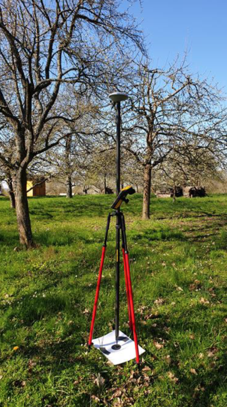
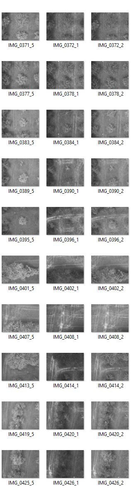

# An introduction to acquire and process data with an Unmanned Aerial Vehicle (UAV)
A documentation to acquire data via UAV and process data with Structure from Motion (SfM) 

## Acquisition

* The data acquisition includes the UAV fligth itself and the measureing of the ground control points (GCP).

## Aim of the workshop
* Get to know what kind of equipment for different UAV systems
* Get to know how to plan and perform an UAV fligth
* Get to know how to use a GNSS receiver
* Acquire own data with an UAV.

## Exercises
1. Proof if the equipment ist comprehensive
2. Prepare the UAV for takeoff
3. Plan the fligth route 
4. Perform the UAV fligth
5. Landing UAV and take care of the data
6. Clean up

## So (oder ähnlich) sieht's am Ende aus

More information [here](https://rgeo.de/en/p/streuobst/)

 

     

 

### Technical requirements:
- Unmanned Aerial Vehicle (UAV)
     Sensors used in this case
     - Zamnese X5S camera
     - Micasense Multispectral camera (4 bands including NIR)
- License for Agisoft Metashape Professional

 

Source: [itsfourland](https://its4land.com/fly-and-create)

 

The data acquisition includes the UAV fligth itself and the measureing of the ground control points (GCP).
 

#### 1. UAV fligth

- Requirements:
     - Camera   
          - iPad with DJI app
          - SD card
     - Multispectral camera:
          - Reference panel
          - Micro SD card
     
Set the fligth route via app and set the fligth parameters. The fligth parameters depend on the target area and objects.

Here are some fligth parameters based on the experiences with monitoring orchards.
Fligth heigth: 30m or with high trees 35m
Image overlaps: 90% in fligth direction and 70% orthogonal to the fligth direction.

After landing, a check of the ligth on top of the multispectral camera is needed to eliminate potential failures.

     

    
 
 

#### 2. Measureing Groud Control Points (GCP)
- Requirements:
     - [TrimbleGeo7xGNSS](https://geospatial.trimble.com/products-and-solutions/geo-7x-gnss)

The GCP are important to georeference the processed data precisly. 
More information can be found [here](https://www.dronedeploy.com/blog/what-are-ground-control-points-gcps/).

The GCP can be exported and printed automatically with Agisoft Metashape.
Theoretically, with sufficient resolution of the GCP Agisoft Metashape should recognize the GCP in the data processing automatically. However, if this is not the case the GCP have to set manually.

THe GCP measurements to be exported as a csv file for every measurement and can be copied on a SD card in the 

 

     
 

--- 

## Processing - Structure from Motion (SfM)

* [Presentation about SfM principles](https://www.youtube.com/watch?v=iJTqlb7gsWY)
* WebODM and Agisoft Metashape
* Open Source: 
 - [OpenDroneMap](https://www.opendronemap.org/webodm/)
 - [VisualSfM](http://ccwu.me/vsfm/index.html)

#### 1. Sort

The acquiered data can be sorted by date and sensor. The micasense folder need an extra directory for the reference panels.

Let's start with the multispctral data!

> gdfgdf
> 

 

 

After creating a point cloud in Agisoft it can look like the example below.

 

